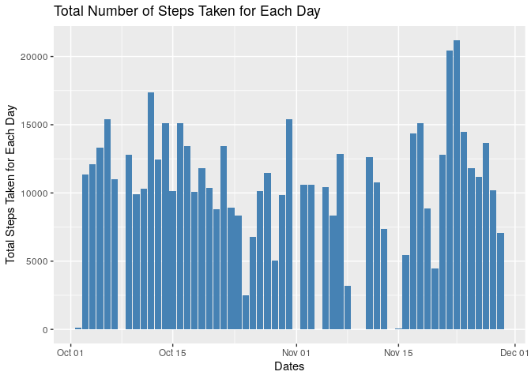
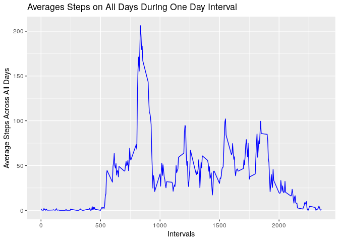
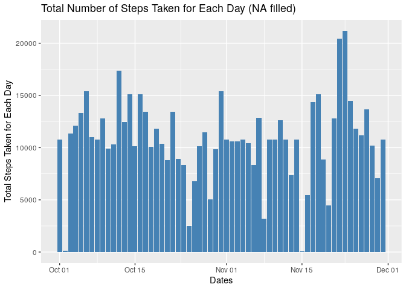
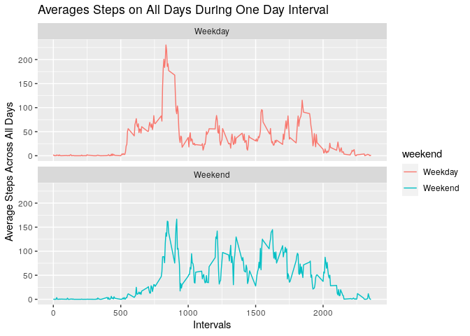

### Setting up Working Environment
**Please modified the necessary path to set the working directory and un-comment the code below**

```r
#setwd("/JH_DataScience/5_Reproducible_Research/Week 2/project/RepData_PeerAssessment1-master")
```

**Import Library**

```r
library(ggplot2)
library(dplyr)
```

## Project Description
This is a peer review project. This project was forked from https://github.com/rdpeng/RepData_PeerAssessment1


## Loading and preprocessing the data
The following documents the details of processing data
**Data Source**: Data was included in a zip file from the original forked.

### Unzip and read data

```r
#unzip("activity.zip")
```


```r
activity <- read.csv("activity.csv")
str(activity)
```

```
## 'data.frame':	17568 obs. of  3 variables:
##  $ steps   : int  NA NA NA NA NA NA NA NA NA NA ...
##  $ date    : chr  "2012-10-01" "2012-10-01" "2012-10-01" "2012-10-01" ...
##  $ interval: int  0 5 10 15 20 25 30 35 40 45 ...
```

### Processing Raw Data 
**We need to process the raw data such as the date into datetime format:**

```r
activity$date <- as.Date(activity$date, format="%Y-%m-%d")
```


## What is mean total number of steps taken per day?
**1. Calculate the total number of steps taken per day**

```r
stepsByDay <- activity %>%
    filter(!is.na(activity$steps)) %>%
    group_by(date) %>%
    summarise(stepsPerDay=sum(steps))
stepsByDay
```

```
## # A tibble: 53 × 2
##    date       stepsPerDay
##    <date>           <int>
##  1 2012-10-02         126
##  2 2012-10-03       11352
##  3 2012-10-04       12116
##  4 2012-10-05       13294
##  5 2012-10-06       15420
##  6 2012-10-07       11015
##  7 2012-10-09       12811
##  8 2012-10-10        9900
##  9 2012-10-11       10304
## 10 2012-10-12       17382
## # ℹ 43 more rows
```

**2. Make a histogram of the total number of steps taken each day**

```r
ggplot(stepsByDay, aes(x=date, y=stepsPerDay)) + geom_bar(stat = "identity", fill="steelblue") +labs(title = "Total Number of Steps Taken for Each Day", x="Dates", y="Total Steps Taken for Each Day")
```

<!-- -->

**3. Calculate and report the mean and median of the total number of steps taken per day**

```r
summary(stepsByDay$stepsPerDay)
```

```
##    Min. 1st Qu.  Median    Mean 3rd Qu.    Max. 
##      41    8841   10765   10766   13294   21194
```

Therefore, the Median of total number of steps per day is `10765` steps and the average steps per day is `10766` steps.

## What is the average daily activity pattern?
**1. Make a time series plot (i.e. type = "l") of the 5-minute interval (x-axis) and the average number of steps taken, averaged across all days (y-axis)**


```r
stepsByInterval <- activity %>%
    filter(!is.na(activity$steps)) %>%
    group_by(interval) %>%
    summarise(averageSteps=mean(steps))
stepsByInterval
```

```
## # A tibble: 288 × 2
##    interval averageSteps
##       <int>        <dbl>
##  1        0       1.72  
##  2        5       0.340 
##  3       10       0.132 
##  4       15       0.151 
##  5       20       0.0755
##  6       25       2.09  
##  7       30       0.528 
##  8       35       0.868 
##  9       40       0     
## 10       45       1.47  
## # ℹ 278 more rows
```


```r
ggplot(stepsByInterval, aes(x=interval, y=averageSteps))+geom_line(color="blue")+labs(title="Averages Steps on All Days During One Day Interval", x="Intervals", y="Average Steps Across All Days")
```

<!-- -->

**2. Which 5-minute interval, on average across all the days in the dataset, contains the maximum number of steps?**


```r
stepsByInterval[which.max(stepsByInterval$averageSteps),]
```

```
## # A tibble: 1 × 2
##   interval averageSteps
##      <int>        <dbl>
## 1      835         206.
```

Therefore, the time period that contains the maximum number of steps is at **8:35am**.

## Imputing missing values
**1. Calculate and report the total number of missing values in the dataset (i.e. the total number of rows with NAs)**

```r
sum(is.na(activity))
```

```
## [1] 2304
```

**2. Devise a strategy for filling in all of the missing values in the dataset. The strategy does not need to be sophisticated. For example, you could use the mean/median for that day, or the mean for that 5-minute interval, etc.**

```r
head(activity)
```

```
##   steps       date interval
## 1    NA 2012-10-01        0
## 2    NA 2012-10-01        5
## 3    NA 2012-10-01       10
## 4    NA 2012-10-01       15
## 5    NA 2012-10-01       20
## 6    NA 2012-10-01       25
```


```r
newDfTemp <- activity %>% mutate(newSteps=ifelse(is.na(steps),stepsByInterval$averageSteps,activity$steps))
head(newDfTemp)
```

```
##   steps       date interval  newSteps
## 1    NA 2012-10-01        0 1.7169811
## 2    NA 2012-10-01        5 0.3396226
## 3    NA 2012-10-01       10 0.1320755
## 4    NA 2012-10-01       15 0.1509434
## 5    NA 2012-10-01       20 0.0754717
## 6    NA 2012-10-01       25 2.0943396
```

**3. Create a new dataset that is equal to the original dataset but with the missing data filled in.**


```r
newDf <- select(newDfTemp, -steps)
head(newDf)
```

```
##         date interval  newSteps
## 1 2012-10-01        0 1.7169811
## 2 2012-10-01        5 0.3396226
## 3 2012-10-01       10 0.1320755
## 4 2012-10-01       15 0.1509434
## 5 2012-10-01       20 0.0754717
## 6 2012-10-01       25 2.0943396
```


**4. Make a histogram of the total number of steps taken each day and Calculate and report the mean and median total number of steps taken per day. Do these values differ from the estimates from the first part of the assignment? What is the impact of imputing missing data on the estimates of the total daily number of steps?**


```r
newStepsByDay <- newDf %>%
    group_by(date) %>%
    summarise(stepsByDay=sum(newSteps))
head(newStepsByDay)
```

```
## # A tibble: 6 × 2
##   date       stepsByDay
##   <date>          <dbl>
## 1 2012-10-01     10766.
## 2 2012-10-02       126 
## 3 2012-10-03     11352 
## 4 2012-10-04     12116 
## 5 2012-10-05     13294 
## 6 2012-10-06     15420
```


```r
ggplot(newStepsByDay, aes(x=date, y=stepsByDay)) + geom_bar(stat = "identity", fill="steelblue") +labs(title = "Total Number of Steps Taken for Each Day (NA filled)", x="Dates", y="Total Steps Taken for Each Day")
```

<!-- -->


```r
summary(newStepsByDay$stepsByDay)
```

```
##    Min. 1st Qu.  Median    Mean 3rd Qu.    Max. 
##      41    9819   10766   10766   12811   21194
```

**The mean and median is the same 10766 steps. There is no difference between the mean compare against the first assignment.**

**The reason of no difference is because, there is only 8 days missing. In addition, we use the avergae steps of each time interval as the replacement. Hence it is inline with the daily average**

**By filling the missing day with the average, there will be no impact if you are looking at daily average steps taken. However, it will increase the total steps taken in total.**


## Are there differences in activity patterns between weekdays and weekends?

**1. Create a new factor variable in the dataset with two levels – “weekday” and “weekend” indicating whether a given date is a weekday or weekend day.**


```r
weekdayDf <- mutate(newDf, weekday=weekdays(newDf$date))
head(weekdayDf)
```

```
##         date interval  newSteps weekday
## 1 2012-10-01        0 1.7169811  Monday
## 2 2012-10-01        5 0.3396226  Monday
## 3 2012-10-01       10 0.1320755  Monday
## 4 2012-10-01       15 0.1509434  Monday
## 5 2012-10-01       20 0.0754717  Monday
## 6 2012-10-01       25 2.0943396  Monday
```


```r
weekendDf <- mutate(weekdayDf, weekend=ifelse(weekdayDf$weekday %in% c('Sunday', 'Saturday'), 'Weekend', 'Weekday'))
head(weekendDf)
```

```
##         date interval  newSteps weekday weekend
## 1 2012-10-01        0 1.7169811  Monday Weekday
## 2 2012-10-01        5 0.3396226  Monday Weekday
## 3 2012-10-01       10 0.1320755  Monday Weekday
## 4 2012-10-01       15 0.1509434  Monday Weekday
## 5 2012-10-01       20 0.0754717  Monday Weekday
## 6 2012-10-01       25 2.0943396  Monday Weekday
```

**2. Make a panel plot containing a time series plot (i.e. type = "l") of the 5-minute interval (x-axis) and the average number of steps taken, averaged across all weekday days or weekend days (y-axis). See the README file in the GitHub repository to see an example of what this plot should look like using simulated data.**


```r
stepsByIntervalWeekEnd <- weekendDf %>%
    group_by(interval, weekend) %>%
    summarise(averageSteps=mean(newSteps))
head(stepsByIntervalWeekEnd)
```

```
## # A tibble: 6 × 3
## # Groups:   interval [3]
##   interval weekend averageSteps
##      <int> <chr>          <dbl>
## 1        0 Weekday       2.25  
## 2        0 Weekend       0.215 
## 3        5 Weekday       0.445 
## 4        5 Weekend       0.0425
## 5       10 Weekday       0.173 
## 6       10 Weekend       0.0165
```


```r
ggplot(stepsByIntervalWeekEnd, aes(x=interval, y=averageSteps, color=`weekend`))+geom_line()+facet_wrap(~`weekend` , ncol = 1, nrow=2)+labs(title="Averages Steps on All Days During One Day Interval", x="Intervals", y="Average Steps Across All Days")
```

<!-- -->

**On average, steps taken on the weekend is higher then weekday. However, on weekdays steps between 8am to 10am is higher. We can attribute the surges could be weekday commuting to work.**

### End of Project
